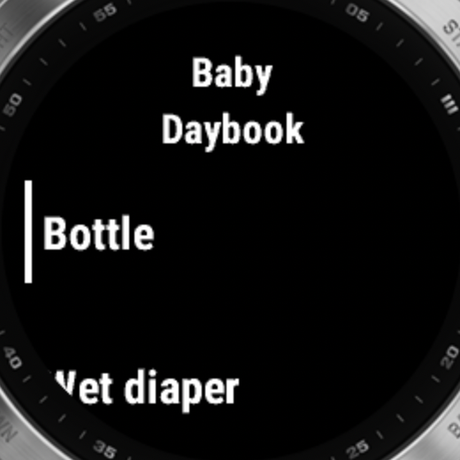
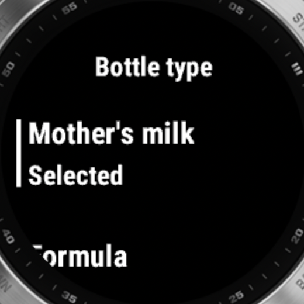
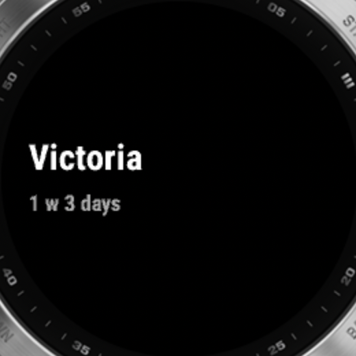

# Baby Daybook for Garmin

A private Connect IQ app for recording Baby Daybook bottle and diaper events
from the Garmin fēnix 7 family. It works with Garmin's default watch faces and
does not publish complication data.

## Screenshots

| Main menu | Bottle type | Glance |
| --- | --- | --- |
|  |  |  |

## Install

The current build is a private Garmin beta. Install it while signed into the
Garmin account that owns the beta:

1. Pair and sync the watch with Garmin Connect, then install the **Connect IQ
   Store** app on the phone if it is not already installed.
2. Open the private [Baby Daybook beta listing](https://apps-developer.garmin.com/apps/d319a3ff-9e5d-4a1d-bb79-2674276e1ac9)
   in the same signed-in Garmin account.
3. Select **Download**, choose the watch, review the Internet communication
   permission, and select **Allow**.
4. Open Garmin Connect or Connect IQ and sync the watch. **Baby Daybook** will
   appear in the watch's Apps list when installation finishes.
5. Complete the provisioning steps below, save the app settings, and sync once
   more.

Supported devices are the Enduro 2, fēnix 7/7S/7X families (including Pro
models), and tactix 7.

## Provisioning

Open the GitHub Pages setup flow on your phone. Sign in with Apple, copy the
resulting one-time `intent://callback…` address into the provisioning page,
choose the baby, then copy the generated `connectiq://oauth…` setup code.
Paste that complete code into **Connect IQ → My Device → My Apps → Baby
Daybook → Settings → Setup**, save, and sync the watch.

The page exchanges that one-time Apple credential directly with Baby Daybook's
Firebase project, loads the signed-in account's baby profiles, and returns the
selected baby UID plus refresh token into the setup code. The Apple credential
exists only in page memory. For the `?sync=1` browser sync fallback, the page
stores the selected baby UID and rotating refresh token in local browser
storage and sends event batches only to the Fly sync relay; nothing is
submitted to GitHub Pages. The watch UI uses Garmin's native `Menu2` and
`Picker` controls.

## Build

Install the Connect IQ SDK and create `keys/developer_key.der` as described in
[`app/DEVELOPMENT.md`](app/DEVELOPMENT.md), then run:

```sh
cd app
monkeyc -d fenix7 -f monkey-beta.jungle \
  -o bin/BabyDaybook-beta-fenix7.prg \
  -y ../keys/developer_key.der -r
```

Export the multi-device beta package with:

```sh
monkeyc -e -f monkey-beta.jungle \
  -o bin/BabyDaybook-beta.iq \
  -y ../keys/developer_key.der -r
```

### Publish a beta quickly

The Garmin Developer portal has no supported publishing CLI. This repository
automates its normal browser upload with Playwright and the installed Chrome;
credentials and cookies remain in a local profile outside the repository.

Install the small automation dependency and sign in once:

```sh
npm install
npm run garmin:login
```

Then build/export the IQ package and publish it:

```sh
npm run garmin:publish -- \
  --version 0.3.0-beta.1 \
  --notes "Native Garmin controls and settings-based provisioning."
```

Use `--dry-run` to validate the package, version, and notes without contacting
Garmin. The default package is `app/bin/BabyDaybook-beta.iq`. Set
`GARMIN_PUBLISH_PROFILE` to use a different local Chrome profile, or
`GARMIN_APP_ID` to target another listing. A failed upload saves a diagnostic
screenshot at `output/playwright/garmin-publish-error.png`.

## GitHub Pages

[`site/`](site/) is deployed by [the Pages workflow](.github/workflows/pages.yml)
to <https://kamilio.github.io/baby-daybook-garmin/> whenever `main` changes.

## Tests

```sh
cd app
monkeyc -d fenix7 -f monkey.jungle \
  -o bin/BabyDaybookTest.prg \
  -y ../keys/developer_key.der -t
monkeydo bin/BabyDaybookTest.prg fenix7 -t
```
